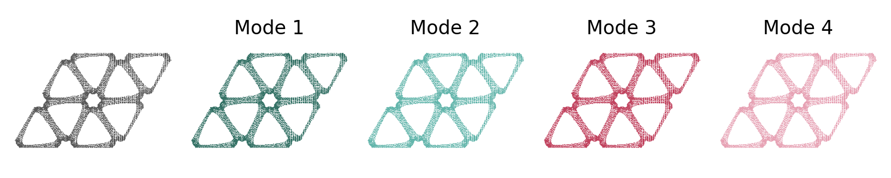

<div align="center">

# Bi-FORK: Generative Modeling of Symmetry-Breaking Bifurcations

[](https://www.python.org/downloads/release/python-3120/)
[](https://pytorch.org/docs/stable/)
[](https://lightning.ai/docs/pytorch/stable/)
[](https://hydra.cc/)

</div>

This is the code repository for **Bi-FORK**.

# Overview

Bi-FORK is a two-stage generative model for symmetry-breaking bifurcation trajectories.
In the first stage, a Perceiver autoencoder compresses the trajectories into a latent space.
In the second stage, a flow-matching model generates trajectories in that latent space.
At sampling time, [particle guidance](https://arxiv.org/abs/2310.13102) pushes jointly drawn
trajectories apart so that they cover all symmetric solution branches.

<p align="center">
  
</p>

Supported datasets:
- **Beam3D**: buckling of rotationally symmetric 3D beams
- **Mechanical Metamaterials**: mechanical microstructures
- **Allen-Cahn**: phase separation governed by the Allen-Cahn equation

A walkthrough of the full pipeline (data generation, training both stages, sampling with and
without particle guidance) is in the [Beam3D demo notebook](beam3d_example.ipynb).

# Installation

## Requirements

- Python >= 3.12, < 3.14
- Linux with a CUDA 13.2 compatible GPU
- PyTorch 2.12.1 (installed automatically by `uv sync`)

## Setup

Clone the repository and install dependencies using [uv](https://docs.astral.sh/uv/):

```bash
git clone https://github.com/ml-jku/Bi-FORK.git
cd bi_fork
uv sync
```

`uv sync` installs all dependencies and this repository's `bifurcation` library. Activate it
with `source .venv/bin/activate`, or prefix commands with `uv run`. Verify the installation with:

```bash
uv run python -c "import bifurcation; print(bifurcation.__file__)"
```

# Data

Each experiment reads its split from a subdirectory of `paths.data_dir`:

| Dataset | Experiment | Directory | Generator |
|---|---|---|---|
| Beam3D | `beam3d/*` | `data/beam3d` | `data_generation/beam3D` |
| Mechanical Metamaterials | `microstructures/*` | `data/microstructures` | seee Github repository: [[1](https://github.com/FHendriks11/mechmetamat_homogenization), [2](https://github.com/FHendriks11/wallpaper_microstructures)] |
| Allen-Cahn | `allencahn/*` | `data/allencahn` | `data_generation/allen_cahn` |

Normalization statistics are stored in the dataset configs in `configs/data/`.

## Data and output paths

Defaults are in `configs/paths/local.yaml`. Override paths on the command line when needed:

```bash
uv run python -m bifurcation.train experiment=beam3d/first_stage \
  paths.data_dir=/absolute/path/to/data \
  paths.logs_root=/absolute/path/to/logs \
  paths.models_root=/absolute/path/to/models
```

Use `env=remote` only with the corresponding remote configuration.

# Training

Training is managed via [Hydra](https://hydra.cc/) and [PyTorch Lightning](https://lightning.ai/).

## Quick Start

```bash
# first stage: autoencoder
uv run python -m bifurcation.train experiment=beam3d/first_stage

# second stage: latent flow matching on top of the first-stage checkpoint
uv run python -m bifurcation.train experiment=beam3d/second_stage \
  model.first_stage_ckpt=/absolute/path/first-stage/checkpoints/final.ckpt
```

The final checkpoint of each stage is written below `paths.models_root` as
`checkpoints/final.ckpt`. Replace `beam3d` with `microstructures` or `allencahn` for the other
datasets.

## Overriding Configurations

Hydra allows overriding any configuration parameter from the command line:

```bash
# change the batch size
uv run python -m bifurcation.train experiment=beam3d/first_stage data.batch_size=64

# resume from a checkpoint
uv run python -m bifurcation.train experiment=beam3d/first_stage ckpt_path=/absolute/path/last.ckpt

# log only to CSV
uv run python -m bifurcation.train experiment=beam3d/first_stage logger=csv
```

## Logging

Training is logged to [Weights & Biases](https://wandb.ai/) and to CSV files next to the
checkpoints by default (`configs/logger/wandb_and_csv.yaml`). Set your W&B team or username
via the `WANDB_ENTITY` environment variable, or use `logger=csv` to skip W&B.

# Evaluation

Run the evaluator with a second-stage checkpoint:

```bash
uv run python scripts/particle_guidance.py \
  --dataset beam3d \
  --ckpt /absolute/path/to/second-stage/checkpoints/final.ckpt \
  --data-dir /absolute/path/to/data \
  --n-samples 8 \
  --n-trials 360 \
  --num-steps 10 \
  --w-score-repulsive 1.0 \
  --out particle_guidance_results/beam3d
```

The script uses the saved Hydra model configuration beside the checkpoint when available,
predicts each sample's bifurcation frames when the checkpoint has a bifurcation head, and writes
`samples.csv`, `report.csv`, and `summary.txt`.

# Acknowledgments

- [azula](https://github.com/probabilists/azula) - diffusion formalism
- [Particle Guidance](https://arxiv.org/abs/2310.13102) - diverse joint sampling


# Citation

If you like our work, please consider giving it a star 🌟 and cite us

```bibtex
@misc{zimmel2026bifork,
      title={Bi-FORK: Generative Modeling of High-Dimensional Bifurcating Systems}, 
      author={Anna Zimmel and Fleur Hendriks and Markus Holzleitner and Florian Sestak and Martin Weichselbaumer and Vlado Menkovski and Johannes Brandstetter},
      year={2026},
      eprint={2610.12449},
      archivePrefix={arXiv},
      primaryClass={cs.LG},
      url={https://arxiv.org/abs/2610.12449}, 
}
```
